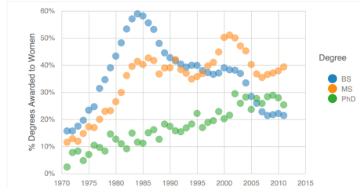
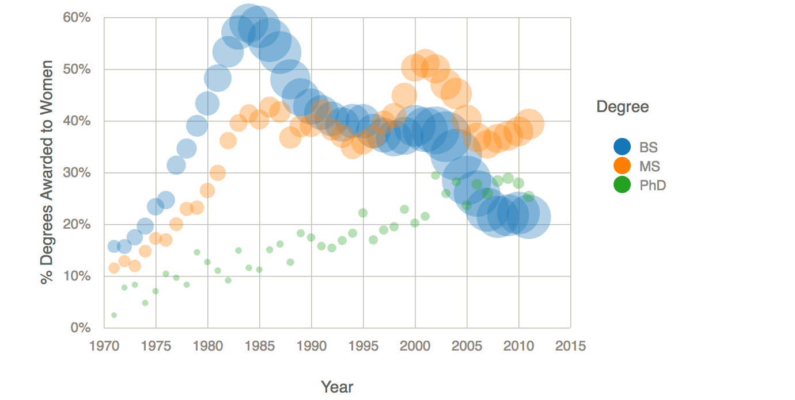
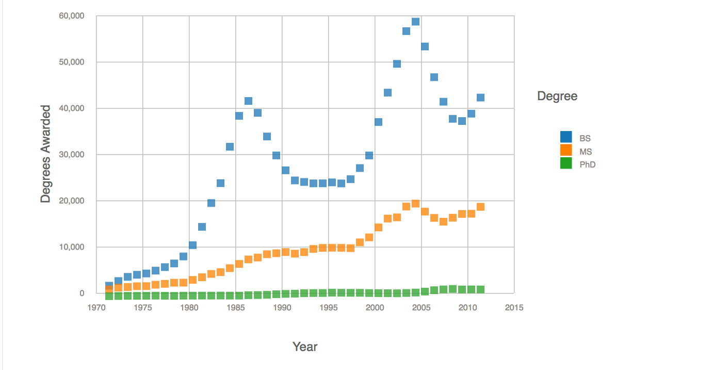
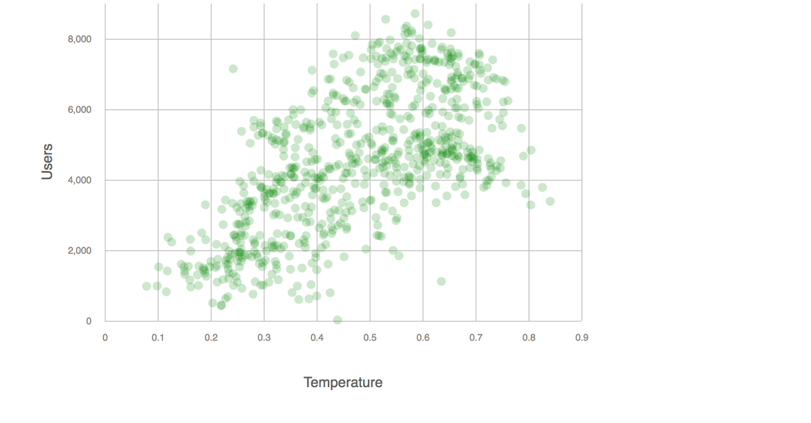
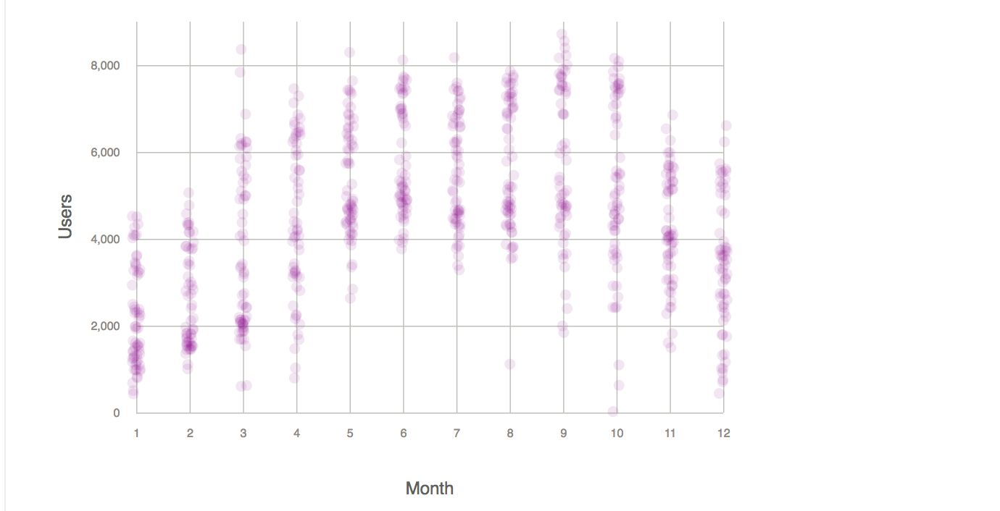

Personal Portfolio of d3 Visualizations

# CS573 17F Assignments 

## North Atantic Hurricanes
A simple bar chart showing the number of hurricanes by decade from 1911-2011. Data from 

## Global Carbon Emissions, 1751-2014

[Line Chart](https://bl.ocks.org/sajudson/ad02a7cf9ba7fd7eed0017ecd4dd0b13)

## Computer Science Degrees by Level and Gender, 1971-2011

[Fraction of Women Awarded Degrees](https://bl.ocks.org/sajudson/826ac078c16fdadbc3a7ab7ca98cda94)

[Fraction of Women Awarded Degrees with Total Number of Degrees Awarded (encoded as size)](https://bl.ocks.org/sajudson/8c527fe6a8bef275851f8e067892851a)

[Total Number of Degrees Awarded](https://bl.ocks.org/sajudson/159113faca3611883a34bdaf460c020a)

 

## DC Bike Share Data Set

[Bike Share Users vs Apparent Temperature](https://bl.ocks.org/sajudson/e482a1b939f342aa2d486481b318748c)
 

[Bike Share Users by Month](https://bl.ocks.org/sajudson/81785b46712ce7480ad2556800db9dde)
 

## Other work

### Messing about in D3

The interactive visulation can be found [here](https://sajudson.github.io/01-ghd3/index.html).

### Data Visualization 10 Ways

See the README.md [here](https://github.com/sajudson/02-DataVis-10ways) for a detailed analysis of 10 different visualization tools used to reproduce the same visualization and the design approach taken. The tools used included MS Excel (painful but possible), Tableau (easy but expensive), R's base graphics and ggplot2, Plot.ly via the R API, Python's matplotlib and Bokeh modules, d3, and HighCharts.

### Animated Transitions and Semantic Color Mapping

The [visualization](https://sajudson.github.io/03-Animation/index.html) shows the transition of a bar chart into a ring or donut chart. A detailed description of the animation and design choices can be found [here](https://github.com/sajudson/03-Animation/blob/master/README.md) 

### Other Works in Progress
https://bl.ocks.org/sajudson/ad02a7cf9ba7fd7eed0017ecd4dd0b13
https://bl.ocks.org/sajudson/8c527fe6a8bef275851f8e067892851a
https://bl.ocks.org/sajudson/81785b46712ce7480ad2556800db9dde

## Data Sources

### Global Carbon Emmissions, 1751-2014
[Data Summary](https://bl.ocks.org/sajudson/d1094a88bc612e2b0d8ac7952080f0db)

This data set contains the total annual global carbon emssions, in units of one million metric tons of carbon, from 1751 to 2014, by source. The sources of these emissions include combustion of fossil fuels (gas, liquid, and solid), cement manufacturing, and gas flaring. Per capita emissions data is provided starting in 1950, once reliable global population estimate were available.

This data was compiled by the [Carbon Dioxide Information Analysis Center](http://cdiac.ornl.gov/&sa=D&ust=1505598980404000&usg=AFQjCNE2q30jmgOabhyONR2h038d32fyjQ). The original electronic file is [Global CO2 Emissions from fossil fuel buring, cement manufacturing, and gas flaring](http://cdiac.ornl.gov/ftp/ndp030/global.1751_2014.ems). This file was imported into excel and saved as a CSV file. Note that CDIAC is shutting down on September 30, 2017. This data will be transferred to the LBNL [ESS-DIVE](http://ess-dive.lbl.gov/) web site after September, 30, 2017.

### Degrees in Computer Science, 1971 to 2011
[Data Summary](https://bl.ocks.org/sajudson/772c6d0f442c16f98928bf5831646cb0)

This data set contains the number of bachelors, masters, and doctoral degrees in computer science (and related fields) awarded each year between 1971 and 2011 to men and women, by degree level. This data is from National Center for Education Statistics 
[Table 349](https://nces.ed.gov/programs/digest/d12/tables/dt12_349.asp), "Degrees in computer and information sciences conferred by degree-granting institutions, by level of degree and sex of student: 1970-71 through 2010-11." The original file can be found [here](https://nces.ed.gov/programs/digest/d12/tables/xls/tabn349.xls) in MS Excel format. Original data set was reformated (unstacked) in MS Excel to facilitate visualization.

This data source includes data orginally found in U.S. Department of Education, National Center for Education Statistics, Higher Education General Information Survey (HEGIS), "Degrees and Other Formal Awards Conferred" surveys, 1970-71 through 1985-86; Integrated Postsecondary Education Data System (IPEDS), "Completions Survey" (IPEDS-C:87-99); and IPEDS Fall 2000 through Fall 2011, Completions component. (This table was prepared July 2012.)

### Washington DC Bike Share Use Statistics, 2011-2012
[Data Summary from Week2](https://bl.ocks.org/sajudson/772c6d0f442c16f98928bf5831646cb0)

The data set contains the number of bike share system users (casual and registered) for each day (and hour) for two years (Jan 2011 - Dec 2012), as well as the day type (holiday, workingday), weather situation, temperature and humidity, apparent temperature and windspeed. This data is from [UCI Machine Learning Repository: Bike Sharing Data Set](https://archive.ics.uci.edu/ml/datasets/bike+sharing+dataset). The dataset file can be found [here](https://archive.ics.uci.edu/ml/machine-learning-databases/00275/Bike-Sharing-Dataset.zip) as a zip archive.

